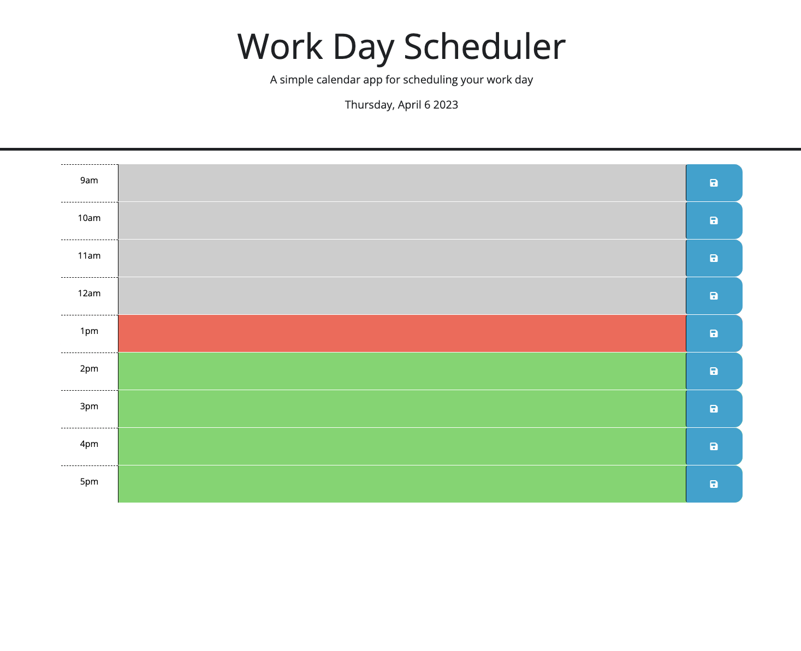

# Work Day Scheduler
displays the hours of the day and allows the user to save taskes to each hour in local memory

## Description

This provides an hourly planner in the browser. You are able to 
save a task to a specific hour block between 9am to 5pm. The tasked
is saved in memory so you can safely leave or reload the page. 

## Image

